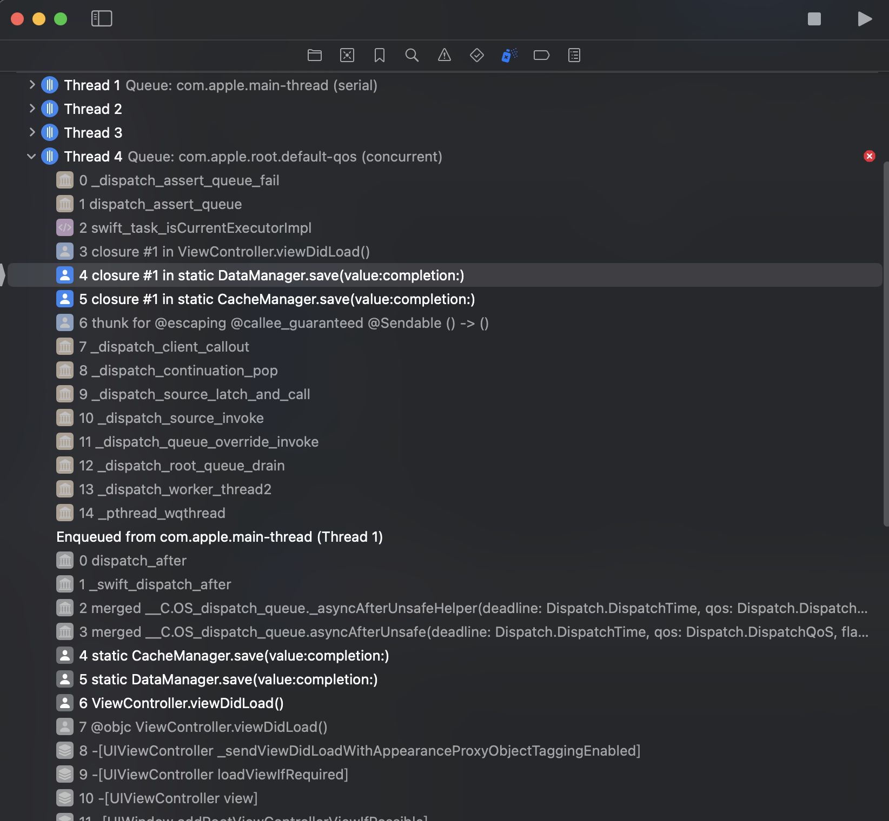
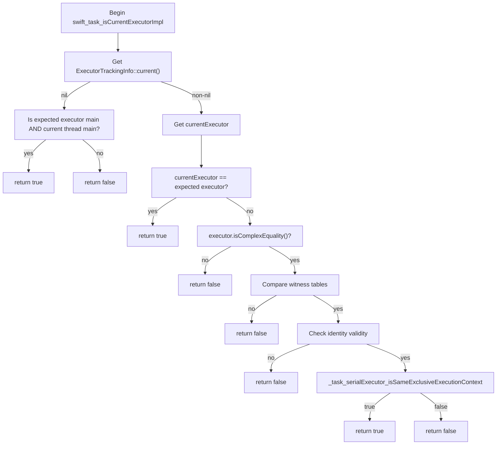
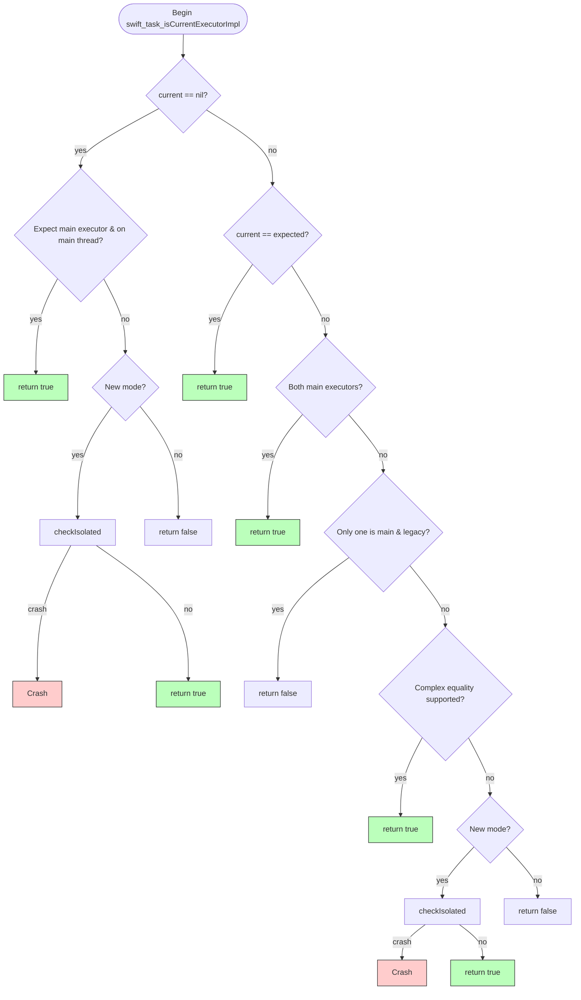
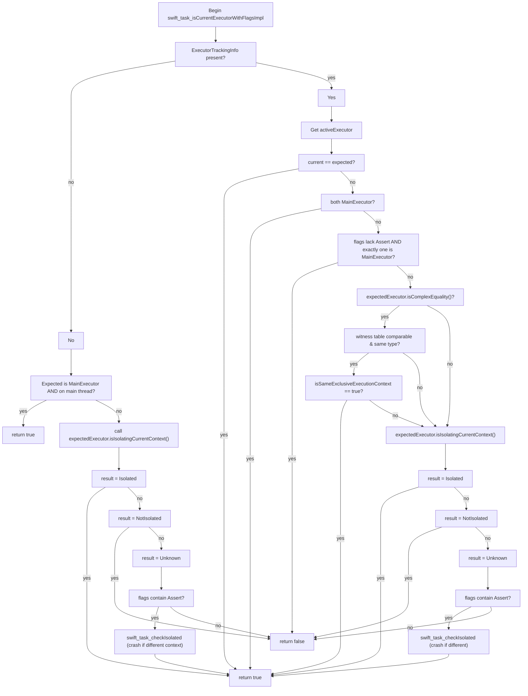

Swift 6 introduces stricter concurrency isolation checks and supports incremental, module-by-module migration. Although Apple’s recommended strategy looks gentle, in practice you may hit hidden runtime crashes—especially when Swift 5 and Swift 6 modules coexist.

This post dissects two real-world cases that frequently trip teams during Swift 6 incremental migration. We’ll connect them to Swift Runtime source, explain the design and crash triggers, and end with practical mitigations and upgrade advice.

## TL;DR

- Swift 6 adds isolation checks (`swift_task_checkIsolated`) that, by default, crash at runtime to prevent data races.
- When a Swift 6 module calls into a Swift 5 module using a non-`@Sendable` escaping closure, the isolation check can crash at runtime—without compile-time diagnostics.
- `@preconcurrency` **only affects compile-time** cross-module checking; it does **not** disable Swift 6’s **runtime** isolation checks. Mixed Swift 5/6 remains crash-prone at runtime.
- Recommendation: upgrade bottom-up and mark critical escaping closures as `@Sendable` as early as possible.
- We provide source-level analysis showing how the crash is triggered and how to override behavior with an environment variable (debug-only).

------

# Migration Strategy Overview: Designing an Incremental Swift 6 Plan

According to the Swift migration docs, Swift 6 can be adopted **by module**. Different modules can progress in parallel. A workable staging plan:

1. Set `SWIFT_STRICT_CONCURRENCY = complete` for a module and fix compile **errors**.
2. Keep **complete** and gradually eliminate migration **warnings**.
3. Switch that module’s `SWIFT_VERSION` to **6** to enable Swift 6 mode.
4. Repeat the cycle until all modules are migrated.

------

# Early Warning: When WebKit Meets Complete Strict Concurrency

## An Example

Assume you’ve maintained and shipped the following code for a long time:

```swift
import UIKit
import WebKit

class ViewController: UIViewController, WKNavigationDelegate {

    private var webView: WKWebView!

    override func viewDidLoad() {
        super.viewDidLoad()
        webView = WKWebView(frame: view.bounds)
        webView.navigationDelegate = self
        webView.load(URLRequest(url: URL(string: "<https://www.apple.com>")!))
        view.addSubview(webView)
    }

    func webView(_ webView: WKWebView,
                 decidePolicyFor navigationAction: WKNavigationAction,
                 decisionHandler: @escaping (WKNavigationActionPolicy) -> Void) {
        // your business logic
        print("decidePolicyFor navigation action")
        decisionHandler(.allow)
    }

    func webView(_ webView: WKWebView,
                 decidePolicyFor navigationResponse: WKNavigationResponse,
                 decisionHandler: @escaping (WKNavigationResponsePolicy) -> Void) {
        // your business logic
        print("decidePolicyFor navigation response")
        decisionHandler(.allow)
    }
}
```

If you set `SWIFT_STRICT_CONCURRENCY` = `Complete`, you get a clean build and it runs fine.

On **Xcode 15**, everything still looks fine. But after upgrading to **Xcode 16**, you’ll see a warning like:

```swift
Instance method 'webView(_:decidePolicyFor:decisionHandler:)' nearly matches optional requirement 'webView(_:decidePolicyFor:decisionHandler:)' of protocol 'WKNavigationDelegate'
```

If you ignore this warning, the delegate method may not be called properly at runtime, causing functional regressions or production bugs.

## **What happened?**

Compare the WKNavigationDelegate definitions:

```swift
/// before iOS 18
public protocol WKNavigationDelegate : NSObjectProtocol {
    @available(iOS 8.0, *)
    optional func webView(_ webView: WKWebView,
                          decidePolicyFor navigationAction: WKNavigationAction,
                          decisionHandler: @escaping (WKNavigationActionPolicy) -> Void)
}

/// iOS 18
@MainActor public protocol WKNavigationDelegate : NSObjectProtocol {
    @available(iOS 8.0, *)
    optional func webView(_ webView: WKWebView,
                          decidePolicyFor navigationAction: WKNavigationAction,
                          decisionHandler: @escaping @MainActor @Sendable (WKNavigationActionPolicy) -> Void)

    @available(iOS 8.0, *)
    optional func webView(_ webView: WKWebView,
                          decidePolicyFor navigationAction: WKNavigationAction) async -> WKNavigationActionPolicy
}
```

Starting in iOS 18, WebKit added `@MainActor` (and `@Sendable` on the handler), which means your existing implementation no longer matches the protocol signature.

For a mid/large codebase, moving Strict Concurrency to **Complete** is intended to surface Swift 6-related warnings for progressive fixes. ⚠️ These warnings may look unrelated to Swift 6, but they blow up under Swift 6’s stricter checks. Ignoring them creates hidden risk.

## **Fix**

```swift
// Swift 5/6; minimum iOS 16; builds on Xcode 15 & 16.
// Key: implement the async variant on iOS 18+; keep the old signature for older OSes,
// and mark it obsoleted on iOS 18 to avoid “nearly matches”.

import UIKit
import WebKit

final class ViewController: UIViewController, WKNavigationDelegate {

    private var webView: WKWebView!

    override func viewDidLoad() {
        super.viewDidLoad()
        webView = WKWebView(frame: view.bounds)
        webView.navigationDelegate = self
        view.addSubview(webView)
        webView.load(URLRequest(url: URL(string: "<https://www.apple.com>")!))
    }

    // iOS 18+: async variant
    @available(iOS 18.0, *)
    func webView(_ webView: WKWebView,
                 decidePolicyFor navigationAction: WKNavigationAction) async -> WKNavigationActionPolicy {
        // business logic (MainActor)
        return .allow
    }

    // Old signature for older OSes; obsoleted on iOS 18 to avoid “nearly matches”.
    @available(iOS, introduced: 8.0, obsoleted: 18.0)
    func webView(_ webView: WKWebView,
                 decidePolicyFor navigationAction: WKNavigationAction,
                 decisionHandler: @escaping (WKNavigationActionPolicy) -> Void) {
        decisionHandler(.allow)
    }

    // (Recommended) Do the same for navigationResponse:
    @available(iOS 18.0, *)
    func webView(_ webView: WKWebView,
                 decidePolicyFor navigationResponse: WKNavigationResponse) async -> WKNavigationResponsePolicy {
        return .allow
    }

    @available(iOS, introduced: 8.0, obsoleted: 18.0)
    func webView(_ webView: WKWebView,
                 decidePolicyFor navigationResponse: WKNavigationResponse,
                 decisionHandler: @escaping (WKNavigationResponsePolicy) -> Void) {
        decisionHandler(.allow)
    }
}
```

## **Conclusion**

**ABI stability ≠ SDK source compatibility.** If `@MainActor`/`@Sendable` annotations change on `@objc` protocol methods, you must **rebuild against the new SDK** or provide conditional implementations.

------

# **The Real Pitfall: Cross-Module Async Callbacks Trigger Isolation Crashes**

## **Second Example**

After cleaning up ModuleA under `SWIFT_STRICT_CONCURRENCY` = `Complete` (no errors/warnings), you flip **Swift Language Mode** to **6**:

```swift
// ModuleA
// no warning
// SWIFT_STRICT_CONCURRENCY = completed
// SWIFT_VERSION = 6
@preconcurrency import ModuleB

class ViewController: UIViewController {
    override func viewDidLoad() {
        DataManager.save(value: "foo") {
            print("bar")
        }
    }
}

// ModuleB
// no warning
// SWIFT_STRICT_CONCURRENCY = completed
// SWIFT_VERSION = 5
import ModuleC

public final class DataManager {
    public static func save(value: String, completion: @escaping () -> Void) {
        CacheManager.save(value: value) {
            completion()
        }
    }
}

// ModuleC
// SWIFT_STRICT_CONCURRENCY = completed
// SWIFT_VERSION = 5
final class CacheManager {
    static func save(value: String, completion: @escaping () -> Void) {
        DispatchQueue.global().asyncAfter(deadline: .now() + 1) {
            completion() // Warning: Capture of 'completion' with non-sendable type '() -> Void' in a '@Sendable' closure
        }
    }
}
```

💥 On iOS 18+ you’ll hit a crash at runtime.



## **Root Cause**

ViewController is `@MainActor`-isolated by default; `DataManager` and `CacheManager` are `nonisolated`. With Swift 6’s runtime isolation checks enabled, if a closure whose isolation is inferred/expected to be `@MainActor` **runs on a non-main executor**, `swift_task_checkIsolated` will assert and crash.

## **Deep Dive into the Runtime**

### Swift 5.10 — Lenient



### Swift 6.0 — Introduces swift_task_checkIsolated



### Swift 6.2 — Current (more nuanced flags)



Takeaway, Since Swift 6.0, `swift_task_checkIsolated` is used to assert when the current executor doesn’t match the expected isolation. **Swift 6.2** refines the decision via flags, but the core idea remains.

### **When Are Asserts Enabled?**

1. **Swift runtime version & SDK linkage**

- **Newer Swift Runtime (e.g., Swift 6 or later)** → **crash allowed** by default; the Assert flag is **on**.
- **Older runtime / old app not rebuilt** → legacy mode; **no crash**; Assert is **off**.

```cpp
swift_task_is_current_executor_flag
__swift_bincompat_useLegacyNonCrashingExecutorChecks() {
  swift_task_is_current_executor_flag options = swift_task_is_current_executor_flag::None;
#if !SWIFT_CONCURRENCY_EMBEDDED
  if (!swift::runtime::bincompat::
      swift_bincompat_useLegacyNonCrashingExecutorChecks()) {
    options = swift_task_is_current_executor_flag(
        options | swift_task_is_current_executor_flag::Assert);
  }
#endif
  return options;
}

bool swift_bincompat_useLegacyNonCrashingExecutorChecks() {
#if BINARY_COMPATIBILITY_APPLE
  switch (isAppAtLeastFall2024()) {
  case oldOS: return true; // Legacy behavior on old OS
  case oldApp: return true; // Legacy behavior for old apps
  case newApp: return false; // New behavior for new apps
  }
#else
  return false; // Always use the new behavior on non-Apple OSes
#endif
}
```

1. **Environment variable override**

- Override crash/legacy behavior via **`SWIFT_IS_CURRENT_EXECUTOR_LEGACY_MODE_OVERRIDE`** (read internally via `concurrencyIsCurrentExecutorLegacyModeOverride`).
- Values: `crash` / `swift6` (enable Assert) or `nocrash` / `legacy` (disable Assert).

```cpp
static void swift_task_setDefaultExecutorCheckingFlags(void *context) {
  auto *options = static_cast<swift_task_is_current_executor_flag *>(context);

  auto modeOverride = swift_bincompat_selectDefaultIsCurrentExecutorCheckingMode();
  if (modeOverride != swift_task_is_current_executor_flag::None) {
    *options = modeOverride;
  }
}

if (const char *modeStr = __swift_runtime_env_useLegacyNonCrashingExecutorChecks()) {
    if (strcmp(modeStr, "nocrash") == 0 || strcmp(modeStr, "legacy") == 0) {
      options = swift_task_is_current_executor_flag(
        options & ~swift_task_is_current_executor_flag::Assert);
    } else if (strcmp(modeStr, "crash") == 0 || strcmp(modeStr, "swift6") == 0) {
      options = swift_task_is_current_executor_flag(
        options | swift_task_is_current_executor_flag::Assert);
    }
}
```

**Summary:**

| **Source**        | **Behavior**                      |
| ----------------- | --------------------------------- |
| SDK ≥ “Fall 2024” | Assert on → potential crash       |
| Env var override  | Can disable Assert for debugging  |
| Older SDK / app   | Legacy mode by default → no crash |

### **Environment Variable Workaround (Debug Only)**

- **Name**: `SWIFT_IS_CURRENT_EXECUTOR_LEGACY_MODE_OVERRIDE`
- **Value**: `legacy` (or `nocrash`); use `crash` / `swift6` to force Assert.
- **Where**: Xcode ▸ Scheme ▸ Run ▸ **Environment Variables**.

> This overrides the Assert flag decision. Useful for diagnosis/transition, **not for production.**

## **Fix**

Add `@Sendable` to escaping closures in `ModuleB` and `ModuleC`. (Optionally, you could also declare `@MainActor`, but this article focuses on `@Sendable` only)

```swift
// Module B
// SWIFT_STRICT_CONCURRENCY = completed
// SWIFT_VERSION = 5
public final class DataManager {
    public static func save(value: String, completion: @escaping @Sendable () -> Void) {
        CacheManager.save(value: value) {
            completion()
        }
    }
}

// Module C
// SWIFT_STRICT_CONCURRENCY = completed
// SWIFT_VERSION = 5
final class CacheManager {
    static func save(value: String, completion: @escaping @Sendable () -> Void) {
        DispatchQueue.global().asyncAfter(deadline: .now() + 1) {
            completion()
        }
    }
}
```

In fact, you can ignore ModuleC: adding `@Sendable` to **ModuleB**’s public callback is often sufficient; alternatively, switching **ModuleB** to Swift 6 (Language Mode) also avoids the crash.

**Observed matrix:**

| **Module A** | **Module B** | **Module C** | **Result** |
| ------------ | ------------ | ------------ | ---------- |
| 6            | 5            | 5            | 💥          |
| 6            | 6            | 5            | ✅          |
| 6            | 5            | 6            | 💥          |
| 6            | 6            | 6            | ✅          |

When ModuleC is upgraded to Swift 6, this remains a **warning** rather than an **error**. Detecting and fixing this early in development is still important.

From these experiments, a conservative upgrade strategy is **bottom-up**, migrating leaf dependencies first. However, third-party dependencies may still block you; `@preconcurrency` does not help with this crash.

### **Third-Party Libraries**

For example, `Alamofire` **5.10.0** adapted to Swift 6 Concurrency: it adds `@Sendable` to all escaping closures. If you’re preparing a Swift 6 migration, first audit whether your dependencies have completed Swift 6 Concurrency adaptations.

```swift
// 5.9.0
func didReceiveResponse(_ response: HTTPURLResponse,
                        completionHandler: @escaping (URLSession.ResponseDisposition) -> Void)

// 5.10.0
func didReceiveResponse(_ response: HTTPURLResponse,
                        completionHandler: @Sendable @escaping (URLSession.ResponseDisposition) -> Void)
```

## **Extended Case: Combine Has Similar Issues**

```swift
class ViewController: UIViewController {
    private var cancellables = Set<AnyCancellable>()
    private let viewModel = SomeViewModel()

    func setupBinding() {
        viewModel.valuesPublisher
            .filter { !$0.isEmpty }
            .receive(on: DispatchQueue.main)
            .sink { values in
                print("Received values: \\(values)")
            }
            .store(in: &cancellables)
    }
}
```

If the filter closure is defined in a Swift 6 module while the publisher is fired off-main, you can still get an isolation conflict crash.

------

# **Summary & Recommendations**

1. Swift 6 adds runtime isolation checks for thread safety, but mixed Swift 5/6 module graphs make problems harder to spot and prone to runtime crashes.
2. The compiler won’t necessarily diagnose these in Swift 6 modules; `@preconcurrency` cannot suppress runtime checks.
3. Prefer a bottom-up migration: upgrade the deepest dependencies first.
4. Explicitly mark escaping closures `@Sendable`, especially around async operations and callbacks.
5. Audit your third-party dependencies and upgrade to the latest versions.

------

# References

[1] [Swift.org – Incremental Adoption（Swift 6 Concurrency Migration Guide）](https://www.swift.org/migration/documentation/swift-6-concurrency-migration-guide/incrementaladoption)

[2] [Apple Developer Forums – WebKit binary compatibility broken in iOS 18](https://developer.apple.com/forums/thread/758802)

[3] [Swift Runtime Source - Actor.cpp (Swift-5.10)](https://github.com/swiftlang/swift/blob/swift-5.10-RELEASE/stdlib/public/Concurrency/Actor.cpp#L308)

[4] [Swift Runtime Source – Actor.cpp (swift-6.0)](https://github.com/swiftlang/swift/blob/swift-6.0-RELEASE/stdlib/public/Concurrency/Actor.cpp#L405)

[5] [Swift Runtime Source - Actor.cpp (main)](https://github.com/swiftlang/swift/blob/main/stdlib/public/Concurrency/Actor.cpp#L499)

[6] [Swift Runtime Source– Bincompat.cpp（swift_bincompat_useLegacyNonCrashingExecutorChecks）](https://github.com/swiftlang/swift/blob/swift-6.0-RELEASE/stdlib/public/Concurrency/Bincompat.cpp)

[7] [Swift Source – SWIFT_IS_CURRENT_EXECUTOR_LEGACY_MODE_OVERRIDE environment variable](https://github.com/swiftlang/swift/blob/swift-6.0-RELEASE/stdlib/public/Concurrency/Actor.cpp#L499)

[8] [Alamofire – Sendable and concurrency adaptation](https://github.com/Alamofire/Alamofire/pull/3920)



