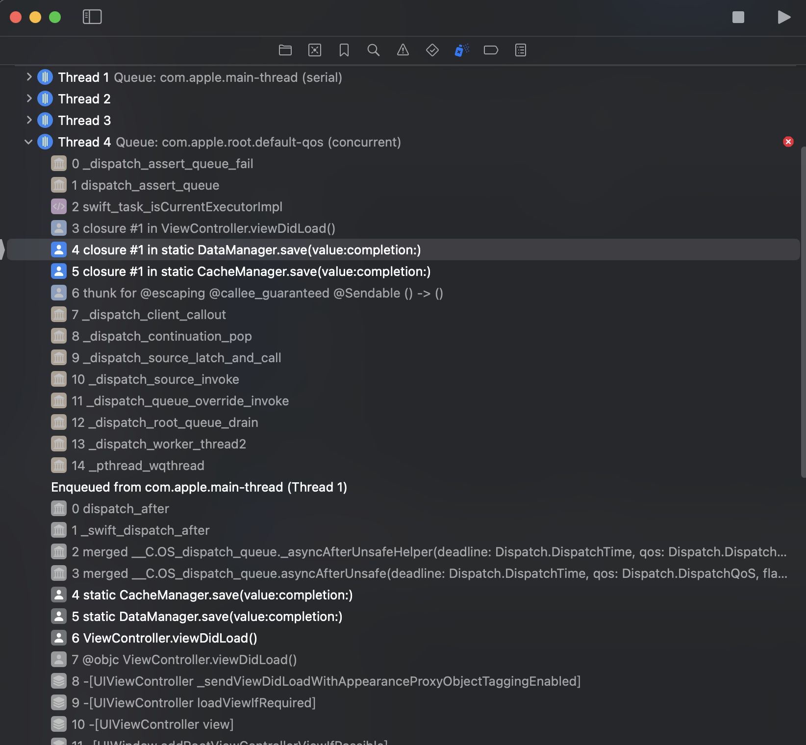
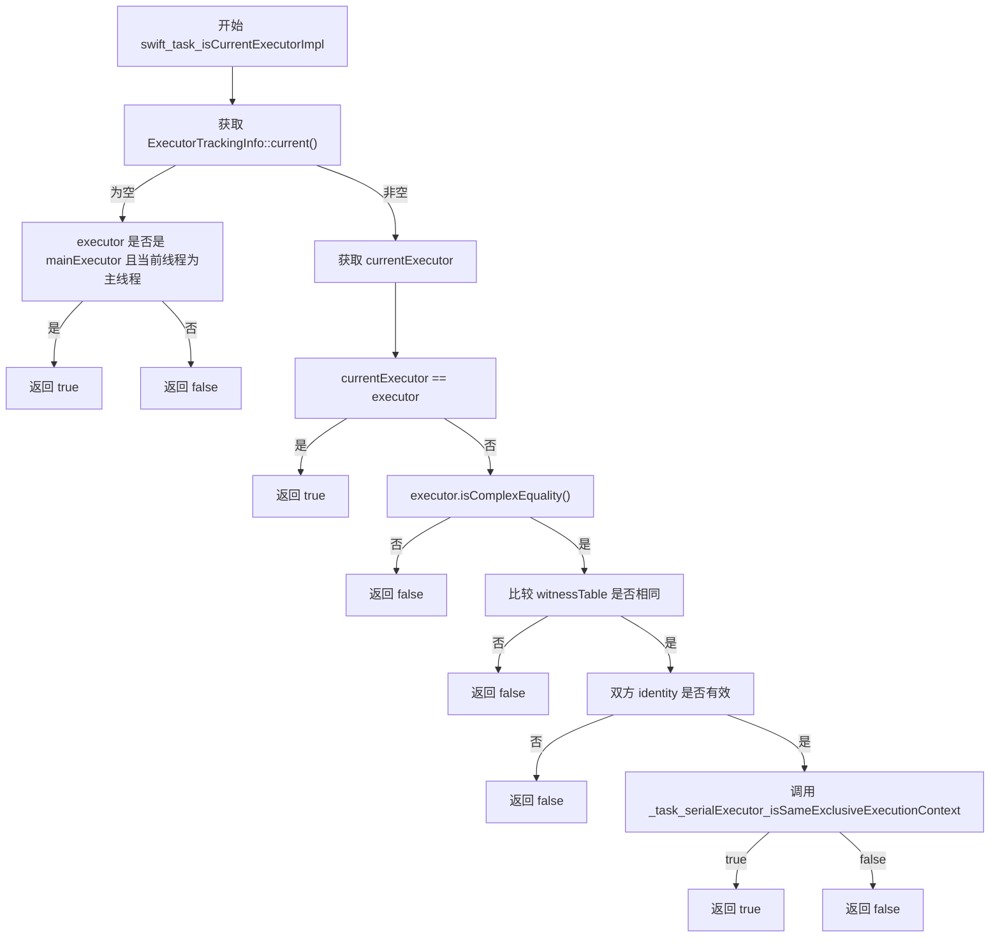
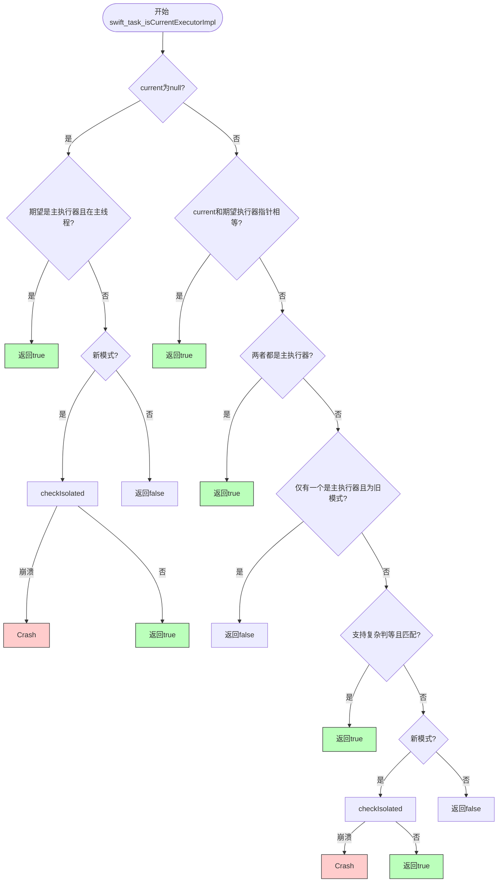
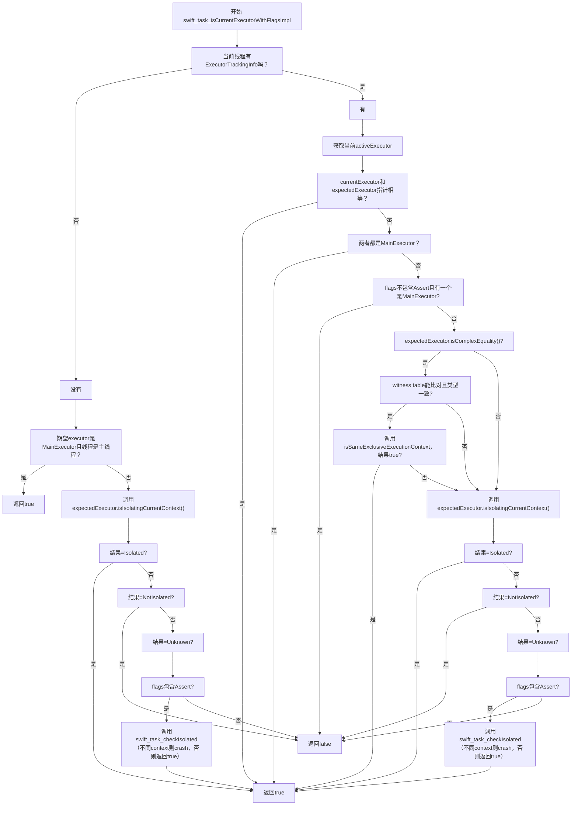

Swift 6 引入了更严格的并发隔离检查机制，支持按模块增量迁移。苹果官方推荐的策略看似温和，但实际操作中却可能触发一些隐藏的运行时崩溃，尤其在存在 Swift 5 和 Swift 6 混编时。

本文将通过两个真实案例深入剖析 Swift 6 增量迁移中容易踩中的隔离检查陷阱，并结合 Swift Runtime 源码解释背后的设计逻辑与崩溃触发机制，最后提供可行的规避方案与升级建议。

## **TL;DR**

- Swift 6 引入隔离校验机制（`swift_task_checkIsolated`），默认会在运行时触发崩溃以防止数据竞争。
- 但在 Swift 6 模块调用 Swift 5 模块的非 `@Sendable` 闭包时，隔离校验会发生运行时崩溃，编译期无法感知。
- `@preconcurrency` **仅影响编译期**跨模块检查，不会关闭 Swift 6 的**运行时**隔离校验，因此混用 Swift 5/6 时仍可能在运行时报错。
- 推荐：升级路径应从底层模块开始，并尽早将关键闭包标注为 `@Sendable`。
- 提供详尽源码分析，说明崩溃是如何触发的以及通过环境变量绕过（仅调试有效）。

------

# 迁移策略概览：如何设计Swift 6增量迁移？

根据Swift 官方文档介绍，迁移Swift 6是可以by module增量进行的，不同module可以持续增量并行。整体阶段可以规划如下：

1. 为模块设置`SWIFT_STRICT_CONCURRENCY = complete`并解决编译error。
2. 保持complete状态，逐步消除该模块迁移产生的warning。
3. 将该模块的`SWIFT_VERSION` 调整为6，正式启用Swift 6模式。
4. 循环上述步骤直到所有模块都完成迁移。

------

# 隐患初现：当WebKit遇上Complete Strict Concurrency

## 一个例子

假设你是一个长期项目维护者，参考下面的这段代码，已经上线运行很长时间了。

```swift
class ViewController: UIViewController, WKNavigationDelegate {
    
    private var webView: WKWebView!

    override func viewDidLoad() {
        super.viewDidLoad()
        // Do any additional setup after loading the view.
        webView = WKWebView(frame: view.bounds)
        webView.navigationDelegate = self
        webView.load(URLRequest(url: URL(string: "<https://www.apple.com>")!))
        view.addSubview(webView)
    }

    func webView(_ webView: WKWebView, decidePolicyFor navigationAction: WKNavigationAction, decisionHandler: @escaping (WKNavigationActionPolicy) -> Void) {
        // do something as your business logic
        print("decidePolicyFor navigation action")
        decisionHandler(.allow)
    }
    
    func webView(_ webView: WKWebView, decidePolicyFor navigationResponse: WKNavigationResponse, decisionHandler: @escaping (WKNavigationResponsePolicy) -> Void) {
        // do something as your business logic
        print("decidePolicyFor navigation response")
        decisionHandler(.allow)
    }
}
```

现在你将模块的`SWIFT_STRICT_CONCURRENCY` 调整至`Complete` ，编译构建，发现没有error，运行后一切也都正常。

若你使用Xcode 15进行开发构建，这一切确实如你所想的正常，没有任何问题。但若升级到Xcode 16，再看这段代码，会看到如下的编译warning：

```swift
Instance method 'webView(_:decidePolicyFor:decisionHandler:)' nearly matches optional requirement 'webView(_:decidePolicyFor:decisionHandler:)' of protocol 'WKNavigationDelegate'
```

如果忽视该 Warning，可能导致运行时 delegate 方法未被正确调用，最终造成功能失效，甚至线上 Bug。

## WTF，发生了什么？

我们仔细对比`WKNavigationDelegate`的API定义就会发现问题所在：

```swift
/// before iOS 18
public protocol WKNavigationDelegate : NSObjectProtocol {
		@available(iOS 8.0, *)
		optional func webView(_ webView: WKWebView, decidePolicyFor navigationAction: WKNavigationAction, decisionHandler: @escaping (WKNavigationActionPolicy) -> Void)
}

/// iOS 18
@MainActor public protocol WKNavigationDelegate : NSObjectProtocol {
		@available(iOS 8.0, *)
		optional func webView(_ webView: WKWebView, decidePolicyFor navigationAction: WKNavigationAction, decisionHandler: @escaping @MainActor @Sendable (WKNavigationActionPolicy) -> Void)
	
		@available(iOS 8.0, *)
	  optional func webView(_ webView: WKWebView, decidePolicyFor navigationAction: WKNavigationAction) async -> WKNavigationActionPolicy
}
```

WebKit在iOS 18后更新了API定义，增加了`@MainActor`和`@Sendable`修饰，而这会导致项目中原先实现的代理方法签名与定义不匹配。

对于一个中大型项目，调整`SWIFT_STRICT_CONCURRENCY`级别的目的就是将Swift 6相关的warning暴露出来，慢慢修复以达到按阶段增量迁移Swift 6的目的。

🚨问题是：这类 Warning 看似与 Swift 6 无关，但恰恰会在 Swift 6 严格检查时暴雷。忽略警告可能会错失关键问题，导致迁移看似顺利，实则隐藏风险。

## 修复方案

```swift
// Swift 5/6 皆可编译；最低 iOS 16；Xcode 15 & 16 均可。
// 要点：iOS 18+ 使用 async 变体；旧系统提供旧签名，并显式标注被 iOS 18 废止以避免“nearly matches”。

import UIKit
import WebKit

final class ViewController: UIViewController, WKNavigationDelegate {

    private var webView: WKWebView!

    override func viewDidLoad() {
        super.viewDidLoad()
        webView = WKWebView(frame: view.bounds)
        webView.navigationDelegate = self
        view.addSubview(webView)
        webView.load(URLRequest(url: URL(string: "<https://www.apple.com>")!))
    }

    // iOS 18+ 推荐实现：async 变体
    @available(iOS 18.0, *)
    func webView(_ webView: WKWebView,
                 decidePolicyFor navigationAction: WKNavigationAction) async -> WKNavigationActionPolicy {
        // 你的业务逻辑（已在 MainActor 隔离）
        return .allow
    }

    // 旧签名：在 iOS 18 被废止，避免与新 SDK 的 @MainActor/@Sendable 签名“近似匹配”
    @available(iOS, introduced: 8.0, obsoleted: 18.0)
    func webView(_ webView: WKWebView,
                 decidePolicyFor navigationAction: WKNavigationAction,
                 decisionHandler: @escaping (WKNavigationActionPolicy) -> Void) {
        decisionHandler(.allow)
    }
}
```

## 结论

**ABI 稳定不等于 SDK 源接口不变**，凡涉及 `@MainActor` / `@Sendable`标注变更的 `@objc` 协议方法，**需要针对新 SDK 重新编译**或提供条件实现。

------

# 真正的坑：跨模块异步回调触发隔离检查crash

## 第二个例子

再来看一个例子，当你辛辛苦苦解决完`ModuleA`在`SWIFT_STRICT_CONCURRENCY` 为`Complete` 模式下的所有编译error和warning后，满怀期待地将**Swift Language Mode**调整为**6** ，示例代码如下：

```swift
// ModuleA
// no warning
// SWIFT_STRICT_CONCURRENCY = completed
// SWIFT_VERSION = 6
@preconcurrency import ModuleB

class ViewController: UIViewController {
    override func viewDidLoad() {
		    DataManager.save(value: "foo") {
            print("bar")
        }
    }
}

// ModuleB
// no warning
// SWIFT_STRICT_CONCURRENCY = completed
// SWIFT_VERSION = 5
import ModuleC

public final class DataManager {
    public static func save(value: String, completion: @escaping () -> Void) {
        CacheManager.save(value: value) {
            completion()
        }
    }
}

// ModuleC
// SWIFT_STRICT_CONCURRENCY = completed
// SWIFT_VERSION = 5
final class CacheManager {
    static func save(value: String, completion: @escaping () -> Void) {
        DispatchQueue.global().asyncAfter(deadline: .now() + 1) {
            completion() // Warning: Capture of 'completion' with non-sendable type '() -> Void' in a '@Sendable' closure
        }
    }
}
```

💥当你尝试在iOS 18+的设备上运行时，你就会遇到crash。



## 原因分析

`ViewController`默认是`@MainActor`隔离的，`DataManager`和`CacheManager`默认`nonisolated`。由于 Swift 6 模块开启了运行时线程隔离校验，若发现该闭包在**非主执行器**环境执行而其隔离被推断/期望为 `@MainActor`，就会触发 `swift_task_checkIsolated` 崩溃 。

## 深入源码

### Swift 5.10

宽松模式

https://github.com/swiftlang/swift/blob/swift-5.10-RELEASE/stdlib/public/Concurrency/Actor.cpp#L308



### Swift 6.0

开始引入**swift_task_checkIsolated**

https://github.com/swiftlang/swift/blob/swift-6.0-RELEASE/stdlib/public/Concurrency/Actor.cpp#L405



### Swift 6.2

https://github.com/swiftlang/swift/blob/main/stdlib/public/Concurrency/Actor.cpp#L499



总体来说，从Swift 6.0开始，官方就加入了`swift_task_checkIsolated`方法，如果不是相同的隔离上下文环境，就会直接crash。Swift 6.2实现更复杂了，但总体思路没有改变。我们可以看到当flags中包含`swift_task_is_current_executor_flag::Assert`时，系统就可能crash，那么继续深入，这个配置是如何决定的？

### Assert是否开启的判断依据

1. Swift 运行时版本和SDK链接方式
   - **新版本Swift Runtime（如 Swift 6 或更高）**，默认**允许 crash**，即 **Assert** 被包含在 flags 里。
   - **旧版本运行时/老应用未重新编译**，则采用 legacy 模式，不允许 crash，**Assert** 不包含在 flags 里。

```cpp
swift_task_is_current_executor_flag
__swift_bincompat_useLegacyNonCrashingExecutorChecks() {
  swift_task_is_current_executor_flag options = swift_task_is_current_executor_flag::None;
#if !SWIFT_CONCURRENCY_EMBEDDED
  if (!swift::runtime::bincompat::
      swift_bincompat_useLegacyNonCrashingExecutorChecks()) {
    options = swift_task_is_current_executor_flag(
        options | swift_task_is_current_executor_flag::Assert);
  }
#endif
  return options;
}

bool swift_bincompat_useLegacyNonCrashingExecutorChecks() {
#if BINARY_COMPATIBILITY_APPLE
  switch (isAppAtLeastFall2024()) {
  case oldOS: return true; // Legacy behavior on old OS
  case oldApp: return true; // Legacy behavior for old apps
  case newApp: return false; // New behavior for new apps
  }
#else
  return false; // Always use the new behavior on non-Apple OSes
#endif
}

static enum sdk_test isAppAtLeastFall2024() {
    const dyld_build_version_t fall_2024_os_versions = {0xffffffff, 0x007e80000};
    return isAppAtLeast(fall_2024_os_versions);
}

static enum sdk_test isAppAtLeast(dyld_build_version_t version) {
  if (__builtin_available(macOS 11.3, iOS 14.5, tvOS 14.5, watchOS 7.4, *)) {
    // Query the SDK version used to build the currently-running executable
    if (dyld_program_sdk_at_least(version)) {
      return newApp;
    } else {
      return oldApp;
    }
  }
  // Older Apple OS lack the ability to test the SDK version of the running app
  return oldOS;
}
```

1. 环境变量覆盖
   - 可以通过**环境变量**覆盖 crash/legacy 行为，主要是 `SWIFT_IS_CURRENT_EXECUTOR_LEGACY_MODE_OVERRIDE`（实际代码里通过 `concurrencyIsCurrentExecutorLegacyModeOverride` 读取）。
   - 取值包括 `crash`/`swift6`（包含 **Assert**），或 `nocrash`/`legacy`（不包含 **Assert**）。

```cpp
static void swift_task_setDefaultExecutorCheckingFlags(void *context) {
  auto *options = static_cast<swift_task_is_current_executor_flag *>(context);

  auto modeOverride = swift_bincompat_selectDefaultIsCurrentExecutorCheckingMode();
  if (modeOverride != swift_task_is_current_executor_flag::None) {
    *options = modeOverride;
  }

  SWIFT_TASK_DEBUG_LOG("executor checking: resulting options = %d", *options);
  _swift_task_debug_dumpIsCurrentExecutorFlags(__FUNCTION__, *options);
}

if (const char *modeStr = __swift_runtime_env_useLegacyNonCrashingExecutorChecks()) {
    if (strcmp(modeStr, "nocrash") == 0 || strcmp(modeStr, "legacy") == 0) {
      options = swift_task_is_current_executor_flag(
        options & ~swift_task_is_current_executor_flag::Assert);
    } else if (strcmp(modeStr, "crash") == 0 || strcmp(modeStr, "swift6") == 0) {
      options = swift_task_is_current_executor_flag(
        options | swift_task_is_current_executor_flag::Assert);
    }
}

// Shimming call to Swift runtime because Swift Embedded does not have
// these symbols defined.
const char *__swift_runtime_env_useLegacyNonCrashingExecutorChecks() {
  // Potentially, override the platform detected mode, primarily used in tests.
#if SWIFT_STDLIB_HAS_ENVIRON && !SWIFT_CONCURRENCY_EMBEDDED
  return swift::runtime::environment::
      concurrencyIsCurrentExecutorLegacyModeOverride();
#else
  return nullptr;
#endif
}
```

总结：

| **来源**             | **行为**                                    |
| -------------------- | ------------------------------------------- |
| SDK 版本 ≥ Fall 2024 | 默认开启 Assert，触发 Crash                 |
| 环境变量             | 可用于开发调试时强制关闭 Assert，避免 crash |
| 旧版本 SDK / App     | 默认使用 legacy 模式，不崩溃                |

### 环境变量绕过方式（仅开发调试有效）

- **环境变量名**：`SWIFT_IS_CURRENT_EXECUTOR_LEGACY_MODE_OVERRIDE`
- **值**：`legacy`（或 `nocrash`）；开启崩溃的值为 `crash`/`swift6`。
- **设置**：Xcode ▸ Scheme ▸ Run ▸ **Environment Variables**。

> 该变量覆盖运行时对 **Assert flags** 的决策，仅用于诊断/过渡，不应在生产使用。

## 修复方案

将`ModuleB`和`ModuleC`中的逃逸闭包显示添加`@Sendable` ，同时也可选明确定义`@MainActor` 。

```swift
// Module B
// SWIFT_STRICT_CONCURRENCY = completed
// SWIFT_VERSION = 5
public final class DataManager {
    public static func save(value: String, completion: @escaping @Sendable () -> Void) {
        CacheManager.save(value: value) {
            completion()
        }
    }
}

// Module C
// SWIFT_STRICT_CONCURRENCY = completed
// SWIFT_VERSION = 5
final class CacheManager {
    static func save(value: String, completion: @escaping @Sendable () -> Void) {
        DispatchQueue.global().asyncAfter(deadline: .now() + 1) {
            completion()
        }
    }
}
```

甚至，我们无需关心 `ModuleC`，只需在 **ModuleB** 中将对外暴露的逃逸闭包标注为 `@Sendable` 就能避免该崩溃；或者将 **ModuleB** 的 Swift Language Mode 切到 6 也能规避。

| **Module A** | **Module B** | **Module C** | **Result** |
| ------------ | ------------ | ------------ | ---------- |
| 6            | 5            | 5            | 💥          |
| 6            | 6            | 5            | ✅          |
| 6            | 5            | 6            | 💥          |
| 6            | 6            | 6            | ✅          |

当我们将`ModuleC`升级至Swift 6时，该warning依然停留在warning，而非error。在这种场景下我们如何在开发期感知到需要去修改这里是个值得思考的问题。

从以上实验可以得出最稳妥的升级策略应该是从底层模块开始往上逐个升级Swift 6。但是这个策略对有问题的三方库依赖依然无法解决，苹果官方文档中所说的`@preconcurrency`对于此问题也根本不起作用。

### 三方库问题

以`Alamofire`为例，在`5.10.0`版本已经修复了所有Swift 6 Concurrency相关的问题，在所有逃逸闭包前标注了`@Sendable`。所以对于那些开始着手准备升级Swift 6项目，请先好好检查你们所依赖的三方库是否已经做好了Swift 6 Concurrency相关适配。

```swift
// 5.9.0
func didReceiveResponse(_ response: HTTPURLResponse, completionHandler: @escaping (URLSession.ResponseDisposition) -> Void) 

// 5.10.0
func didReceiveResponse(_ response: HTTPURLResponse, completionHandler: @Sendable @escaping (URLSession.ResponseDisposition) -> Void)
```

## 案例扩展：Combine也有类似问题

```swift
class ViewController: UIViewController {
    func setupBinding() {
        viewModel.valuesPublisher
            .filter {
                !$0.isEmpty
            }
            .receive(on: DispatchQueue.main)
            .sink {
                print("Received values: \\($0)")
            }
            .store(in: &cancellables)
    }
}
```

如果 filter 的闭包在 Swift 6 模块中定义，而 Publisher 由非主线程触发，则同样会引发隔离冲突崩溃。

------

# 总结与建议

1. Swift 6 带来了线程安全的运行时隔离校验机制，但在Swift 5和Swift 6混合模块环境下，容易触发难以察觉的问题和崩溃。
2. 这些问题编译器不会在Swift 6模块中提示，`@preconcurrency`也无法抑制。
3. 推荐自底向上升级模块，优先处理依赖链最深层的模块。
4. 需要明确标注`@Sendable`，尤其在逃逸闭包、异步操作中。
5. 检查所有三方依赖库，尽量升级到最新版本。

------

# 引用与资料

[1] [Swift.org – Incremental Adoption（Swift 6 Concurrency Migration Guide）](https://www.swift.org/migration/documentation/swift-6-concurrency-migration-guide/incrementaladoption)

[2] [Apple Developer Forums – WebKit binary compatibility broken in iOS 18](https://developer.apple.com/forums/thread/758802)

[3] [Swift Runtime 源码 - Actor.cpp - Swift-5.10](https://github.com/swiftlang/swift/blob/swift-5.10-RELEASE/stdlib/public/Concurrency/Actor.cpp#L308)

[4] [Swift Runtime 源码 – Actor.cpp（swift-6.0）](https://github.com/swiftlang/swift/blob/swift-6.0-RELEASE/stdlib/public/Concurrency/Actor.cpp#L405)

[5] [Swift Runtime 源码 - Actor.cpp (main)](https://github.com/swiftlang/swift/blob/main/stdlib/public/Concurrency/Actor.cpp#L499)

[6] [Swift Runtime 源码 – Bincompat.cpp（swift_bincompat_useLegacyNonCrashingExecutorChecks）](https://github.com/swiftlang/swift/blob/swift-6.0-RELEASE/stdlib/public/Concurrency/Bincompat.cpp)

[7] [Swift 源码 – SWIFT_IS_CURRENT_EXECUTOR_LEGACY_MODE_OVERRIDE 环境变量](https://github.com/swiftlang/swift/blob/swift-6.0-RELEASE/stdlib/public/Concurrency/Actor.cpp#L499)

[8] [Alamofire Sendable与并发适配](https://github.com/Alamofire/Alamofire/pull/3920)




